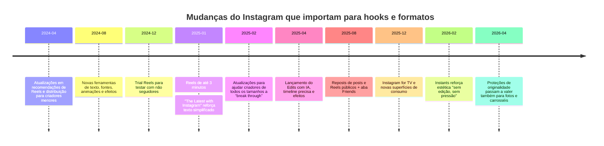
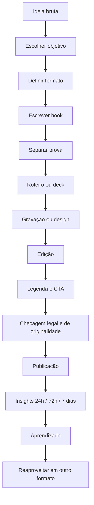
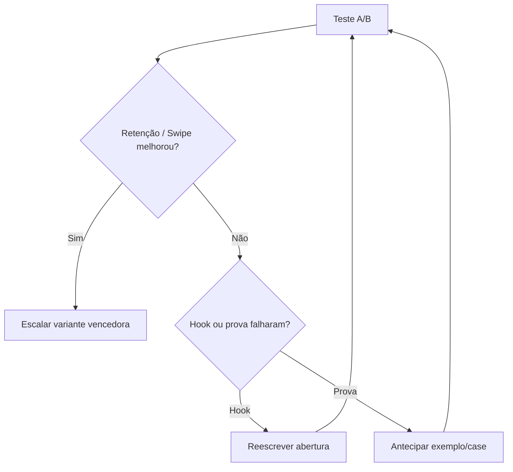

# Hooks para Instagram em Português

## Resumo executivo

Neste relatório, **hook** é tratado como o dispositivo que faz a pessoa parar, entender por que aquele conteúdo importa para ela e decidir continuar consumindo. No Instagram de 2025–2026, isso não é só “uma frase de impacto”: em Reels, o hook precisa trabalhar os **primeiros 1–3 segundos** e conversar com sinais que o próprio Instagram diz usar para recomendação, como **watch time, retenção, compartilhamentos e curtidas**; em carrosséis, ele precisa abrir uma promessa forte no primeiro slide e sustentar a curiosidade no swipe; em posts estáticos, ele depende do conjunto **imagem + headline visual + primeira linha da legenda**. O próprio Instagram recomenda começar Reels com um **hook forte nos primeiros 3 segundos** e fazer com que o vídeo faça sentido mesmo para quem ainda não conhece o criador. citeturn13search0turn19search1turn31search0

As mudanças mais relevantes da plataforma entre 2024 e 2026 apontam para quatro direções centrais. A primeira é a consolidação do vídeo curto como ferramenta de descoberta: em janeiro de 2025, o Instagram ampliou Reels para **até 3 minutos**; em dezembro de 2024, lançou **trial reels** para testar conteúdo com não seguidores; e, em 2025, passou a empurrar com força o app **Edits**, com recursos como timeline precisa, efeitos, IA e áudio em tendência. A segunda é o fortalecimento da **editabilidade visual**, com textos, fontes, animações e efeitos mais ricos em Reels e Stories, além de camadas de texto em fotos e carrosséis. A terceira é a valorização de **originalidade**: em abril de 2026, o Instagram informou que proteções de originalidade aplicadas a Reels em 2024 passariam a valer também para **fotos e carrosséis**, deixando agregadores de reuploads inelegíveis para recomendações. A quarta é a convivência de duas lógicas de performance: diferentes estudos de benchmark de 2025–2026 indicam que **Reels tendem a maximizar alcance**, enquanto **carrosséis lideram engajamento** na maioria dos cenários analisados. citeturn11search2turn11search4turn11search6turn33search2turn33search9turn27search1turn29view0turn16view1turn16view2turn12view12

A implicação prática é clara: se o objetivo é crescimento e descoberta, Reels continuam sendo o formato mais agressivo; se o objetivo é **salvamento, comentário qualificado, compartilhamento e educação**, carrosséis seguem extraordinariamente fortes; e posts estáticos funcionam melhor como peças de **autoridade, prova, estética de marca e posicionamento**, mas hoje exigem um hook muito mais disciplinado do que no passado. Em benchmarks recentes, a Socialinsider encontrou média de engajamento por seguidores de **0,55% para carrosséis**, **0,52% para Reels** e **0,37% para imagens** em 2025; já a Buffer encontrou, em outra metodologia, **6,9% de engajamento medido por alcance para carrosséis** contra **3,3% para Reels**, ao mesmo tempo em que reportou **mais alcance para Reels**. Esses números **não são diretamente comparáveis** porque usam definições e bases amostrais diferentes, mas apontam na mesma direção estratégica: **Reels = descoberta; carrossel = profundidade; estático = precisão e branding**. citeturn29view0turn29view2turn30view2turn16view2turn16view0

Sempre que o Instagram **não especifica oficialmente** um detalhe — por exemplo, “copy ideal por slide”, “tempo ideal universal do Reel” ou “taxa de retenção perfeita” — eu marco isso como **não especificado oficialmente** e proponho uma recomendação operacional baseada em sinais oficiais da plataforma, benchmarks independentes e síntese estratégica.

## Conceitos e taxonomia

### O que é um hook

No contexto de Instagram, um hook é a combinação de sinais verbais, visuais e contextuais que responde, em frações de segundo, a três perguntas silenciosas do usuário: **“isso é para mim?”, “isso vale meu tempo?” e “o que vou ganhar se eu continuar?”**. Em termos práticos, hook não é apenas o “gancho inicial”; ele é a **promessa perceptiva** que dá início à experiência do conteúdo. Em Reels, o hook mora sobretudo no primeiro frame, no primeiro movimento, no primeiro texto em tela e no primeiro trecho de áudio. Em carrosséis, ele mora no primeiro slide e na tensão entre o slide inicial e o próximo swipe. Em posts estáticos, o hook é a soma do visual, da headline da arte e da primeira linha da legenda. Essa leitura é coerente com a forma como o Instagram descreve partes diferentes do app como sistemas de ranking próprios, com Reels orientados por sinais como watch time, retenção, compartilhamentos e curtidas. citeturn32search3turn19search1turn19search0

### Taxonomia funcional dos hooks

A taxonomia abaixo é a mais útil para criação editorial. Ela combina **intenção psicológica** e **mecânica de formato**.

| Tipo de hook | O que ele faz | Melhor uso no Reel | Melhor uso no carrossel | Melhor uso no post estático |
|---|---|---|---|---|
| Hook de dor | Mostra um erro, perda ou frustração | abre com problema explícito | slide 1 com erro comum | arte/legenda que nomeia a dor |
| Hook de benefício | promete ganho concreto | “como conseguir X” | “guia para Y” | “3 passos para Z” na legenda |
| Hook de curiosidade | cria lacuna de informação | “ninguém te conta isso” | “o motivo escondido…” | primeira linha que abre loop |
| Hook de identidade | espelha o público | “se você é [perfil]…” | “para quem…” | “isso é para…” |
| Hook de prova | sinaliza credibilidade | número, caso, resultado | estudo de caso slide 1 | prova social na arte/legenda |
| Hook contrarian | desafia crença popular | “pare de fazer…” | “o conselho errado…” | opinião forte com nuance |
| Hook narrativo | abre uma história | “eu quase…” | “o dia em que…” | legenda em storytelling |
| Hook tutorial | organiza aprendizado | “faça assim” | “passo a passo” | mini-guia em legenda |
| Hook comparativo | coloca A versus B | split-screen | comparativo de slides | arte comparativa |
| Hook aspiracional | evoca futuro desejado | antes/depois | transformação progressiva | imagem aspiracional + copy |

Essa taxonomia dialoga diretamente com práticas que o próprio Instagram vem reforçando: conteúdo que faz sentido para **não seguidores**, uso de **originalidade**, recursos de **texto** e **áudio**, além de mecanismos de **colaboração** e **recomendação**. citeturn13search0turn27search0turn21search3turn22search2turn23search3

### Exemplos mínimos por formato

Abaixo estão exemplos curtos para mostrar como o mesmo tipo de hook se desdobra em cada formato.

| Intenção | Reel | Carrossel | Post estático |
|---|---|---|---|
| Educar | “Você está medindo a métrica errada.” | “A métrica que está sabotando seu Instagram” | “Pare de avaliar conteúdo só por likes” |
| Entreter | “Todo mundo faz isso no Instagram…” | “Tipos de criador que existem em toda agência” | “Confesse: você também faz isso” |
| Inspirar | “Comecei com zero e foi assim” | “O processo real por trás de um resultado grande” | “Nem todo crescimento parece crescimento no começo” |
| Vender | “Antes de contratar, veja isso” | “Como saber se você precisa de [serviço]” | “Se isso acontece com seu conteúdo, você já está perdendo dinheiro” |
| Curiosidade | “O motivo de seu Reel travar não é o que você pensa” | “O erro invisível que derruba retenção” | “Tem um detalhe no seu conteúdo que custa alcance” |

### Como pensar o hook em camadas

O melhor desempenho raramente vem de um hook monolítico. O mais eficiente é trabalhar com **quatro camadas**:

1. **Hook de parada**: aquilo que interrompe o scroll.  
2. **Hook de relevância**: aquilo que faz o público pensar “isso é para mim”.  
3. **Hook de retenção**: aquilo que cria tensão para continuar.  
4. **Hook de conversão**: aquilo que transforma consumo em ação — salvar, compartilhar, comentar, clicar ou seguir.

Em Reels, o hook de parada costuma ser visual e sonoro; em carrosséis, é verbal e composicional; em posts estáticos, é sobretudo visual-semântico. O Instagram também incentiva recursos que podem aumentar essas camadas — templates, remix, collabs, texto, efeitos e áudio — mas não especifica uma “receita oficial universal” de hook; por isso, o framework abaixo é uma **síntese estratégica**, não uma regra formal da plataforma. citeturn21search7turn22search1turn22search2turn23search3turn20search17

## Tendências, benchmarks e cronologia

### O que está realmente “viral” em 2025–2026

A leitura mais rigorosa das fontes mostra que “viral” não é um único estilo. Em 2025–2026, os formatos com mais tração no Instagram combinam: **descoberta por Reels**, **profundidade por carrossel**, **textualização maior da edição**, **uso tático de áudio em tendência**, **testes com não seguidores**, **colaboração/remix**, **crescente importância da originalidade** e uma estética simultaneamente mais editável e mais autêntica. O próprio ecossistema oficial do Instagram reforçou isso com trial reels, Edits, ferramentas de texto simplificadas, recursos de áudio em tendência, templates, remix e collabs; em paralelo, benchmarks externos convergem para a ideia de que carrosséis seguem muito fortes em engajamento, enquanto Reels continuam a liderar descoberta e alcance. citeturn11search6turn11search4turn33search10turn33search2turn32search8turn22search2turn21search7turn29view0turn16view1turn16view2

Uma nuance importante: a própria Meta sinaliza que a experiência está ficando mais sensível a **originalidade e recomendabilidade**. Conteúdo reaproveitado sem transformação suficiente pode limitar recomendação, e isso passou a valer com mais força para fotos e carrosséis em 2026. Para quem publica em português, isso significa que não basta “traduzir um conteúdo estrangeiro” ou repostar prints: é preciso **reinterpretar, contextualizar, adicionar estrutura própria, prova própria e linguagem própria**. citeturn27search0turn27search1turn33search9turn36search5

### Comparativo prático entre formatos

| Formato | Papel principal em 2025–2026 | Vantagem predominante | Risco principal | Uso recomendado |
|---|---|---|---|---|
| Reel | Descoberta e alcance | Mais exposição a não seguidores | Queda rápida de retenção se os 3s iniciais falham | Topo e meio de funil |
| Carrossel | Ensino, autoridade, salvamentos | Maior densidade de mensagem e melhor engajamento | Slide 1 fraco mata o swipe | Meio e fundo de funil |
| Post estático | Branding, prova, posicionamento | Clareza visual e rapidez de produção | Menor prioridade algorítmica isolada | Apoio, prova, opinião, anúncio |

Leituras de benchmark recentes sustentam esse quadro, ainda que com metodologias diferentes. A Buffer descreveu o Instagram como “duas plataformas em uma”: Reels levam vantagem de alcance pela aba própria de descoberta, enquanto carrosséis aprofundam interação. A Socialinsider encontrou carrosséis como formato mais resiliente em engajamento e salvamentos; a Rival IQ também apontou carrosséis à frente de Reels em engajamento em seu relatório de 2025. citeturn16view1turn16view2turn29view0turn12view12

### Benchmarks de referência

| Fonte | Base / definição | Reels | Carrossel | Imagem estática | Como interpretar |
|---|---|---:|---:|---:|---|
| Socialinsider 2026 | 35M posts; engajamento por seguidores | 0,52% | 0,55% | 0,37% | bom para macrocomparação entre formatos |
| Buffer 2026 | 45M+ posts; engajamento como % do alcance | 3,3% | 6,9% | 4,4% | bom para eficiência por pessoa alcançada |
| Buffer reach study | 4M+ posts; alcance mediano | +36% vs carrossel | — | Reels 2,25x imagens | bom para estratégia de descoberta |
| Rival IQ 2025 | benchmark setorial de marcas | abaixo de carrossel | acima de Reels | — | reforça tendência de engajamento de carrossel |

Esses estudos **não são diretamente comparáveis**. Socialinsider calcula engajamento por seguidores; Buffer usa engajamento por alcance em uma de suas análises e alcance mediano em outra. A conclusão robusta não está no número absoluto, e sim no padrão consistente: **carrossel protege profundidade; Reel compra distribuição**. citeturn29view0turn29view2turn30view2turn16view2turn12view12

### Linha do tempo das mudanças relevantes



A cronologia acima se apoia em anúncios e textos oficiais do Instagram/Meta sobre recomendações, trial reels, Edits, reposts, TV, Instants e originalidade. Em termos estratégicos, a linha do tempo mostra duas correntes simultâneas: mais ferramentas de edição e mais exigência de autenticidade/originalidade. citeturn33search2turn33search7turn11search2turn11search4turn5search0turn28search0turn33search0turn33search9

### Tendências táticas que mais importam

As tendências mais acionáveis para conteúdo em português são estas:

| Tendência | Evidência | O que fazer |
|---|---|---|
| Hook explícito nos 3s iniciais | orientação oficial para Reels | abrir com promessa concreta, não com vinheta |
| Conteúdo compreensível por não seguidores | orientação oficial | contextualizar rápido, evitar excesso de “insider language” |
| Texto mais forte na edição | novas text tools | usar headlines curtas, grandes e legíveis |
| Áudio em tendência como alavanca, não muleta | ferramentas oficiais de trend audio | combinar trend + voz/argumento próprio |
| Teste com não seguidores | trial reels | validar hook antes de escalar série |
| Originalidade mais importante em fotos/carrosséis | update de 2026 | evitar reupload e agregação sem transformação |
| Carrossel como formato de autoridade | benchmarks 2025–2026 | transformar insights e processos em séries swipáveis |
| Autenticidade/baixo acabamento polido | Instants + pesquisas de marketing | incluir bastidores, processo, opinião, imperfeição útil |

Ao lado das fontes oficiais do Instagram, pesquisas de mercado de 2025–2026 também reforçam duas ideias: consumidores e profissionais estão reagindo bem a **conteúdo seriado/original** e a **vídeos mais autênticos, menos excessivamente produzidos**. O Sprout Social registrou forte demanda por séries originais; o HubSpot reportou que muitos profissionais enxergam melhor performance em vídeos autênticos/menos produzidos do que em peças altamente polidas. citeturn7search3turn7search8turn33search0turn33search9

## Estrutura de Reels virais

### Arquitetura recomendada do Reel

O Instagram não publica um “tempo ideal universal” para Reels. O que ele explicita é: **hook forte nos primeiros 3 segundos**, conteúdo compreensível para quem não conhece você e sinais de ranking ligados a **watch time, retenção, shares e likes**; além disso, desde janeiro de 2025, Reels podem ter até **3 minutos**. Como regra operacional, a melhor abordagem é trabalhar com **três buckets de teste**: descoberta curta, ensino médio, e explicação mais longa para público mais quente. citeturn13search0turn19search1turn11search2turn15news26

| Bucket | Faixa sugerida | Estado da evidência | Melhor uso |
|---|---|---|---|
| Descoberta curta | 8–15 s | não especificado oficialmente | curiosidade, humor, insight único |
| Ensino rápido | 15–30 s | não especificado oficialmente | dica, erro, passo a passo curto |
| Explicação aprofundada | 30–60 s | não especificado oficialmente | breakdown, case, objeção, prova |
| Longo contextual | 60–180 s | oficial quanto ao máximo; não especificado quanto ao ideal | storytelling, análise, autoridade |

Como heurística, use o menor tempo capaz de entregar a promessa sem perder clareza. Essa é uma inferência estratégica alinhada ao fato de que o Instagram prioriza watch time e retenção — não uma duração “mágica” universal. citeturn19search1turn34search1turn14search14

### Blueprint segundo a segundo

| Faixa | Função | O que precisa acontecer |
|---|---|---|
| 0.0–0.8 s | Interrupção | movimento, rosto, objeto, contraste, texto forte |
| 0.8–2.5 s | Promessa | problema, ganho ou curiosidade explícita |
| 2.5–6 s | Contexto mínimo | prova, mini-caso, “por que isso importa” |
| 6–15 s | Entrega | ponto principal, 1–3 blocos curtos |
| 15–25 s | Expansão | segundo insight, objeção, exemplo |
| 25–fim | Fechamento | payoff, loop, CTA, ou fechamento circular |

Esse blueprint é uma síntese operacional. O ponto factual mais importante é que o Instagram recomenda o hook nos **3 primeiros segundos** e usa sinais como **watch time e retenção** para estimar aquilo que as pessoas podem gostar. citeturn13search0turn19search1

### Técnicas visuais que aumentam retenção

Os recursos mais coerentes com a plataforma hoje são: **texto grande e cedo**, cortes rápidos mas legíveis, uso de **templates**, **remix**, **collab**, efeitos, camadas de texto e áudios. O Instagram também reforçou fontes, animações e efeitos em 2024–2025 e empurrou o Edits como espaço de produção com timeline precisa, efeitos, IA e qualidade de exportação. citeturn21search7turn22search2turn23search3turn33search10turn33search6

Recomendações práticas de alta probabilidade:

- mostrar rosto, mão, tela ou objeto já no primeiro frame;
- colocar a headline em tela até o segundo 1;
- usar no máximo **uma ideia principal por bloco**;
- alternar entre enquadramento amplo e punch-in;
- usar prova visual cedo: print, antes/depois, resultado, erro em destaque;
- terminar em loop semântico, para facilitar replay.

### Sound design

O Instagram oferece biblioteca/licenciamento próprio, trilhas em tendência, importação de áudio, efeitos sonoros e agora ferramentas mais robustas via Edits. Também mostra como encontrar áudio em tendência e, em atualizações anteriores, passou a exibir no ecossistema Creator recursos para ver **trending songs e hashtags** e quantas vezes um áudio foi usado. Para uso orgânico, áudio licenciado pode estar disponível conforme os acordos da plataforma; para impulsionamento/ads, há restrições importantes: Reels impulsionados **não podem usar música licenciada** e a recomendação oficial é usar **royalty-free da Sound Collection** ou áudio original. citeturn20search17turn32search8turn20search2turn20search4turn20search1turn20search0

Boas práticas de sound design:

| Elemento | Recomendação |
|---|---|
| Voz | priorize voz clara sobre trilha alta |
| Trilha | use em volume baixo, como cola emocional |
| Batidas | sincronize cortes-chave com batidas ou ênfases |
| SFX | use só para acentuar; evite excesso “memético” sem função |
| Silêncio | um breve “drop” antes do payoff pode aumentar atenção |
| Legendas | mantenha sempre, mesmo em conteúdo falado |

O Instagram oferece **captions automáticas em português** e recomendações relacionadas a acessibilidade por meio de **alt text** e legendas. Isso é útil tanto para experiência do usuário quanto para compreensão sem som. citeturn9search0turn9search1turn9search11

### Estratégia de legenda, CTA e thumbnail

Em 2025–2026, legenda deixou de ser apenas apoio e passou a ser também **camada de busca**. O Instagram recomenda pesquisar palavras-chave e hashtags, e profissionais da plataforma já afirmaram que elas devem ir na **legenda**, não nos comentários, para ajudar a classificar o conteúdo em busca. citeturn19search3turn9search16

Estrutura de legenda recomendada para Reel:

| Linha | Função |
|---|---|
| Linha 1 | repetir a promessa em palavra-chave (“3 hooks para Reels que seguram retenção”) |
| Linhas 2–4 | ampliar valor ou contexto |
| Linha final | CTA único: salvar, compartilhar ou comentar |
| Rodapé | hashtags específicas, não genéricas |

Sobre thumbnail/capa, o Instagram informa uma **imagem recomendada de 420 × 654 px** para a capa do Reel e observa que, no momento, **não é possível editar a foto de capa depois de publicado**. Portanto, capa não é detalhe: ela deve ser pensada como mini-headline editorial. citeturn10search2

#### Exemplo de thumbnail

```text
┌───────────────────────────────┐
│ [ROSTO / OBJETO EM CLOSE]     │
│                               │
│   3 HOOKS QUE                 │
│   SEGURAM                     │
│   RETENÇÃO                    │
│                               │
│         seta -> detalhe       │
└───────────────────────────────┘
```

Regras práticas:
- 2–5 palavras principais;
- verbo forte ou substantivo de ganho/perda;
- contraste alto;
- um único foco visual.

#### Exemplo de storyboard

```text
Frame 1  0.0s  "Seu Reel morre aqui" + erro visível
Frame 2  1.2s  "O problema não é o algoritmo"
Frame 3  3.0s  prova: gráfico / tela / exemplo
Frame 4  6.0s  correção 1
Frame 5  9.0s  correção 2
Frame 6 12.0s  "salva para revisar antes de postar"
```

### Variáveis prioritárias para A/B test em Reels

| Variável | Versão A | Versão B | Métrica primária |
|---|---|---|---|
| Primeira frase | dor | benefício | retenção inicial |
| Primeiro frame | rosto | tela/objeto | taxa de hold até 3s |
| Estilo de abertura | pergunta | afirmação | watch time |
| Áudio | tendência | original | shares / alcance |
| Texto em tela | 3 palavras | 7 palavras | retenção |
| Ritmo de corte | rápido | médio | avg watch time |
| CTA | salvar | comentar | saves / comments |
| Duração | 12 s | 24 s | avg watch time + follows |
| Capa | promessa | curiosidade | CTR interno de profile/grid |
| Entrega | lista | mini-história | shares |

## Estrutura de carrosséis e posts estáticos

### Blueprint de carrossel slide a slide

O Instagram permite compartilhar **até 20 fotos e vídeos** em uma postagem com múltiplos itens. A plataforma não especifica oficialmente um número “ideal” de slides para carrossel orgânico; portanto, o blueprint abaixo é **recomendação estratégica**, não regra oficial. Em geral, para conteúdo editorial, 6–10 slides tendem a equilibrar profundidade e conclusão. citeturn10search21

| Slide | Função | Copy sugerida |
|---|---|---|
| Slide 1 | Hook | promessa, erro ou curiosidade |
| Slide 2 | Qualificação | “isso é para quem…” / contexto |
| Slide 3 | Tese | o insight central |
| Slide 4 | Desenvolvimento | passo 1 / argumento 1 |
| Slide 5 | Desenvolvimento | passo 2 / argumento 2 |
| Slide 6 | Desenvolvimento | passo 3 / exemplo |
| Slide 7 | Prova | caso, resultado, print, antes/depois |
| Slide 8 | Fechamento | resumo memorável / checklist |
| Slide 9 | CTA | salvar, compartilhar, comentar |
| Slide 10 | Conversão | próximo passo, DM, link na bio, oferta |

O raciocínio por trás desse blueprint combina o que sabemos de benchmark e da plataforma: carrosséis sustentam mais engajamento, convites à ação como **salvar e compartilhar** são especialmente coerentes com o formato, e a lógica de múltiplos frames favorece conteúdo de autoridade, utilidade e densidade. citeturn29view0turn16view1turn16view2

### Fórmulas de headline para o slide inicial

| Fórmula | Exemplo |
|---|---|
| Erro + consequência | “O erro que corta seu alcance sem você perceber” |
| Lista específica | “7 hooks em português para Reels de venda” |
| Promessa temporal | “Como criar um carrossel em 20 minutos” |
| Contrarian | “Pare de abrir carrossel com contexto” |
| Identidade | “Se você vende serviço, leia isso antes de postar” |
| Transformação | “De post ignorado a post salvo” |
| Curiosidade | “O detalhe que faz a pessoa deslizar para o slide 2” |
| Comparativo | “Carrossel bom vs. carrossel que trava” |
| Prova | “O modelo que usei para dobrar salvamentos” |
| Mistura de dor e ganho | “Menos alcance. Mais salvamentos. Eis como.” |

### Hierarquia visual e comprimento de copy

O Instagram não fornece um padrão oficial de “número ideal de palavras por slide” para carrossel orgânico. Portanto, as recomendações abaixo são **não especificadas oficialmente** e devem ser tratadas como guia editorial.

| Elemento | Faixa sugerida | Estado |
|---|---|---|
| Headline do slide | 3–10 palavras | não especificado oficialmente |
| Corpo do slide | 10–30 palavras | não especificado oficialmente |
| Ideias por slide | 1 ideia principal | não especificado oficialmente |
| Fontes | 2 níveis de hierarquia | não especificado oficialmente |
| Elementos de apoio | 1 gráfico/ícone/print por slide | não especificado oficialmente |

Em 2024–2025, o Instagram ampliou ferramentas de texto, efeitos, fontes e possibilidades de personalização, inclusive para fotos e carrosséis. Isso favorece carrosséis mais editoriais, com mais texto em imagem — desde que a legibilidade seja preservada. citeturn23search3turn33search2turn33search5

#### Exemplo de capa de carrossel

```text
┌───────────────────────────────┐
│ O REEL NÃO É                 │
│ O PROBLEMA                   │
│                               │
│ O seU HOOK É.                │
│                               │
│ deslize →                    │
└───────────────────────────────┘
```

### Táticas de retenção por swipe

As táticas de retenção mais úteis em carrosséis são:

| Tática | Como aplicar |
|---|---|
| Open loop | slide 1 promete algo revelado no 4 ou 5 |
| Progressão | “1/7”, “2/7” etc. |
| Alternância | texto → exemplo → checklist → prova |
| Mini cliffhanger | “mas aqui está o detalhe que muda tudo” |
| Prova tardia | segurar case/resultado para slide posterior |
| Contraste | mudar cor de fundo no slide de virada |
| Respiro visual | um slide “quase vazio” no meio para reter |
| CTA em camadas | micro-CTA no slide 2 e CTA final no 9 |

### Blueprint do post estático

O post estático ainda pode funcionar muito bem, mas hoje precisa de uma disciplina maior de hook porque os benchmarks recentes o colocam atrás de Reels e carrosséis em boa parte das comparações. Isso não torna o formato inútil; apenas muda seu papel. Ele funciona especialmente bem para **opinião, manifesto, prova, anúncio, foto autoral, citação forte e estampa de posicionamento**. citeturn29view0turn16view1

Estrutura recomendada para post estático:

| Camada | Função |
|---|---|
| Arte ou foto | parar o scroll |
| Headline visual | prometer valor ou tensão |
| Primeira linha da legenda | repetir e aprofundar a promessa |
| Corpo da legenda | 1 argumento central + 1 exemplo + 1 fechamento |
| CTA | uma ação apenas |

Em busca e descobribilidade, vale a mesma lógica de legenda: **palavras-chave e hashtags na legenda**, não nos comentários. Para conteúdo com fala ou vídeo associado, use captions; para imagem, considere alt text. citeturn9search16turn9search1

## Biblioteca prática de hooks, templates e scripts

### Reel openers por intenção

#### Educar

1. Você está cometendo um erro que parece pequeno, mas mata seu resultado.
2. Se você posta Reels assim, provavelmente está perdendo retenção.
3. O problema do seu conteúdo não é falta de ideia.
4. Três ajustes que deixam seu Reel muito mais fácil de assistir.
5. O jeito certo de abrir um Reel não é esse que te ensinaram.
6. Se você ensina na internet, preste atenção nisto.
7. A maioria das pessoas começa o vídeo pelo ponto errado.
8. Como transformar uma dica comum em um Reel que prende.
9. O erro invisível que derruba seu alcance.
10. O hook que parece simples, mas muda tudo.

#### Entreter

1. Todo criador já passou por isso aqui.
2. Vamos ser honestos: isso no Instagram dá vergonha alheia.
3. Tipos de pessoa quando vai gravar um Reel.
4. Se seu conteúdo tivesse terapia, ele diria isso.
5. O Reel perfeito não existe… mas esse erro existe em todos.
6. O algoritmo vendo você fazer isso:
7. Coisas que só quem trabalha com conteúdo vai entender.
8. Você grava assim e depois culpa o Instagram?
9. Isso aqui é muito “criador em modo desespero”.
10. O momento exato em que seu Reel perde a plateia.

#### Inspirar

1. Se eu tivesse começado de novo, faria isso primeiro.
2. O conteúdo que mudou meu jeito de postar não foi o mais bonito.
3. Crescer não começou quando meu perfil explodiu.
4. O dia em que parei de tentar parecer grande e comecei a crescer.
5. Seu melhor conteúdo pode nascer do que você acha “simples”.
6. O que fez diferença não foi talento, foi estrutura.
7. Não espere confiança para começar assim.
8. O conteúdo mais forte às vezes nasce do processo, não do resultado.
9. O que ninguém mostra sobre criar com consistência.
10. Você não precisa soar gigante para soar valioso.

#### Vender

1. Antes de contratar alguém para seu Instagram, veja isso.
2. Se seu conteúdo não gera isso, você está só postando.
3. Como saber se você precisa de estratégia — e não de mais posts.
4. O que eu mudaria hoje num perfil que quer vender mais.
5. Seu conteúdo pode estar bonito e ainda assim não vender nada.
6. O erro que faz marcas parecerem ocupadas, não estratégicas.
7. Se você vende serviço, seu Reel precisa fazer isso.
8. O detalhe que separa conteúdo “bonito” de conteúdo que converte.
9. Você não precisa de mais views; precisa disso aqui.
10. O atraso entre postar e vender costuma começar aqui.

#### Curiosidade

1. O verdadeiro motivo de seu Reel travar talvez não seja o algoritmo.
2. Tem um ponto no começo do vídeo que quase todo mundo ignora.
3. O detalhe que faz a pessoa assistir mais dois segundos.
4. O tipo de frase que parece boa, mas afasta atenção.
5. Você provavelmente nunca reparou nisso nos Reels que performam.
6. Existe um jeito de abrir vídeo que parece errado, mas funciona.
7. O que os Reels mais fortes têm em comum não é o áudio.
8. O erro que parece refinado demais para ser o problema.
9. Tem uma microdecisão que muda seu watch time.
10. Uma pergunta simples pode salvar seu próximo Reel.

### Hooks de primeiro slide para carrossel

#### Educar

1. O carrossel que ensina mais não é o que tem mais slides.
2. A estrutura que faz um carrossel ser salvo.
3. O erro que deixa seu slide 1 morto.
4. Como escrever um slide inicial impossível de ignorar.
5. O que colocar antes do “passo a passo”.
6. Seu carrossel está explicando antes de prometer.
7. A frase que abre melhor um carrossel educativo.
8. Como organizar ideia complexa em slides simples.
9. O jeito mais claro de ensinar no feed hoje.
10. Se seu carrossel não prende no slide 1, nada depois importa.

#### Entreter

1. Tipos de carrossel que todo mundo já postou sem perceber.
2. Confissões de quem vive de Instagram.
3. O bingo de qualquer criador de conteúdo.
4. Se o seu feed falasse, ele diria isso.
5. Coisas que só quem faz carrossel entende.
6. O carrossel mais sincero que você vai ver hoje.
7. Verdades que doem sobre conteúdo.
8. Situações que acontecem em toda estratégia mal feita.
9. Se você já abriu Canva sem saber o que dizer, isso é para você.
10. O retrato fiel de uma ideia boa com execução confusa.

#### Inspirar

1. Crescimento lento também é crescimento.
2. O que parecia pequeno e virou diferencial.
3. Como um processo comum se transforma em autoridade.
4. Começar simples ainda é um ótimo começo.
5. A consistência que ninguém aplaude é a que sustenta tudo.
6. O feed bonito não vale mais do que a mensagem clara.
7. O que mudou quando parei de “performar perfeição”.
8. A diferença entre parecer pronto e realmente evoluir.
9. O bastidor que quase ninguém mostra.
10. A evolução real quase sempre parece discreta no começo.

#### Vender

1. Se você vende serviço, este carrossel é obrigatório.
2. Como saber se seu conteúdo está pronto para vender.
3. O que um perfil precisa mostrar antes da oferta.
4. A sequência de slides que aquece sem parecer “pitch”.
5. O erro que faz sua oferta parecer genérica.
6. Como transformar expertise em prova de compra.
7. O slide que quase todo carrossel de venda esquece.
8. Menos persuasão vazia. Mais clareza de valor.
9. Como fazer o leitor pensar “isso é para mim”.
10. O jeito mais forte de vender sem parecer insistente.

#### Curiosidade

1. O slide 1 que faz as pessoas irem para o slide 2.
2. O detalhe invisível que aumenta swipe.
3. O motivo de alguns carrosséis parecerem “impossíveis de largar”.
4. O erro escondido que corrói seu engajamento.
5. A palavra que muda a leitura do seu slide inicial.
6. O que ninguém te conta sobre carrossel de autoridade.
7. Parece só design — mas não é.
8. O elemento que separa curiosidade de confusão.
9. Tem algo simples aqui que quase ninguém faz.
10. Este é o tipo de abertura que pede swipe.

### Aberturas de legenda para posts estáticos

#### Educar

1. Se você ainda mede conteúdo só por likes, precisa ler isto.
2. O problema da maioria dos posts está na primeira linha.
3. Seu post estático pode performar melhor do que parece — se fizer isso.
4. Você não precisa escrever muito; precisa abrir melhor.
5. Existe um jeito mais inteligente de usar post estático no Instagram.
6. O erro mais comum em legendas aparentemente “boas”.
7. A legenda certa começa antes da explicação.
8. O que separa post lido de post ignorado.
9. Nem todo post precisa vender — mas todo post precisa prometer algo.
10. Se a sua legenda demora demais para chegar ao ponto, este post é para você.

#### Entreter

1. Vamos falar a verdade sobre post estático?
2. Todo mundo já publicou algo assim achando que arrasou.
3. Algumas legendas parecem pedir desculpa por existir.
4. O feed nem sempre perdoa quem enrola.
5. Se o seu post pudesse falar, talvez ele estivesse cansado.
6. O post bonito também sofre quando abre mal.
7. Coisas que o Instagram não disse, mas o público sente.
8. Tem posts que parecem palestra. Outros parecem conversa.
9. Se você já escreveu “passando aqui para…” pare agora.
10. Toda legenda tem uma chance. Algumas desperdiçam em 10 palavras.

#### Inspirar

1. Nem todo conteúdo forte nasce de uma grande ideia.
2. Às vezes, o post certo é o mais simples.
3. Clareza costuma vencer perfeição.
4. O que mais amadureceu meu conteúdo não foi design.
5. Talvez você esteja mais perto de uma voz boa do que imagina.
6. Crescimento nem sempre vem do que grita; às vezes vem do que encaixa.
7. O post que muda percepção quase nunca parece “milagroso”.
8. Você não precisa parecer maior para comunicar melhor.
9. Quando a mensagem encontra forma, o feed responde.
10. O conteúdo mais memorável muitas vezes começa com honestidade.

#### Vender

1. Se você vende serviço, esta legenda importa mais do que parece.
2. Seu post pode estar bonito e ainda assim não mover ninguém.
3. O que seu conteúdo precisa dizer antes da oferta.
4. Vender no Instagram sem clareza é pedir para ser ignorado.
5. O problema não é falta de alcance; às vezes é falta de direção.
6. Se o leitor não se reconhece, ele não avança.
7. O melhor post de venda raramente começa vendendo.
8. Oferta boa com contexto ruim ainda soa genérica.
9. Antes de falar do seu serviço, fale do problema certo.
10. Se sua legenda não cria diagnóstico, dificilmente cria desejo.

#### Curiosidade

1. Tem um detalhe nas legendas fortes que quase ninguém percebe.
2. O motivo de alguns posts segurarem leitura não é “texto bom”.
3. Talvez o seu problema esteja exatamente na primeira frase.
4. Existe uma forma de abrir legenda que parece simples demais.
5. O que faz alguém tocar em “mais” hoje?
6. A maioria das legendas morre antes de começar.
7. Uma única palavra pode mudar sua retenção de leitura.
8. Parece um detalhe pequeno, mas muda o post inteiro.
9. O ponto que faz o leitor continuar ou abandonar.
10. Você pode estar enterrando sua melhor ideia na linha errada.

### Templates reutilizáveis

#### Template de Reel

```text
[HOOK 1–3s]
Se você [perfil/situação], pare de [erro].
O problema não é [culpado comum].
É [causa real].

[ENTREGA]
Faça 1: [passo]
Faça 2: [passo]
Faça 3: [passo]

[CTA]
Salva isso antes de postar o próximo.
```

#### Template de carrossel

```text
Slide 1: [erro/promessa/curiosidade]
Slide 2: Isso é para quem [perfil]
Slide 3: O problema real é [causa]
Slide 4: Ajuste 1
Slide 5: Ajuste 2
Slide 6: Ajuste 3
Slide 7: Exemplo / prova
Slide 8: Resumo
Slide 9: Salve e envie para [tipo de pessoa]
```

#### Template de post estático

```text
[Primeira linha]
Se seu conteúdo parece bom, mas não performa, leia isto.

[Desenvolvimento]
Talvez o problema não seja frequência.
Talvez seja a ausência de uma promessa clara logo no começo.

[Exemplo]
Quando o público entende o ganho em segundos, ele continua.

[CTA]
Qual abertura você mais usa hoje?
```

### Scripts prontos para Reels

| Tema | Script |
|---|---|
| Hook para serviço | “Se você vende serviço e seu Reel começa com apresentação, você já perdeu atenção. Comece assim: diga o problema, mostre o custo do problema e só depois entregue a solução. Salva para usar no próximo vídeo.” |
| Erro de retenção | “Seu Reel não morre por falta de edição. Ele morre porque ninguém entende em 2 segundos por que deveria ficar. Mostre a dor primeiro, depois a explicação. É isso que segura retenção.” |
| Reel educativo | “Três formas de abrir um Reel educativo: 1) ‘o erro que…’, 2) ‘como fazer…’, 3) ‘se você é…’. Testa as três e mede qual segura mais watch time.” |
| Reel de autoridade | “Quer parecer mais estratégico no Instagram? Pare de abrir vídeo com contexto longo. Abra com uma conclusão forte e prove em seguida. Ordem errada derruba atenção.” |
| Reel de venda suave | “Antes de oferecer seu serviço, mostre o que o público perde por continuar do mesmo jeito. Quando ele percebe o custo da inércia, sua solução faz mais sentido.” |
| Reel de bastidor | “Você não precisa de estúdio para ter bom Reel. Precisa de luz decente, texto claro e um começo que prometa algo. O resto é refinamento.” |
| Reel contrarian | “Seu problema talvez não seja o algoritmo. Talvez seja que seu conteúdo pede atenção antes de merecê-la. Dê ao público um motivo explícito para continuar.” |
| Reel com prova | “Quando você abre um vídeo com resultado e só depois explica o processo, a retenção sobe porque a pessoa já sabe o que vai ganhar se ficar.” |
| Reel humor profissional | “Coisas que todo criador faz: passa 40 minutos escolhendo a capa e 4 segundos escrevendo o hook. E depois culpa o alcance.” |
| Reel CTA | “Se você quer mais salvamentos, pare de pedir ‘curte’. Feche com ‘salva para revisar depois’ e alinhe a CTA ao valor do conteúdo.” |

### Scripts prontos para carrossel

| Tema | Script |
|---|---|
| Carrossel educativo | “Slide 1: O erro que mata seu alcance. Slide 2: Isso é para quem posta e não entende a queda. Slide 3: O problema não é frequência. Slide 4: É falta de promessa. Slide 5: É excesso de contexto. Slide 6: É CTA confusa. Slide 7: Exemplo. Slide 8: Resumo. Slide 9: Salve.” |
| Carrossel de venda | “Slide 1: Como saber se você precisa de estratégia. Slide 2: Se seu conteúdo não gera diagnóstico, atenção ou prova… Slide 3–6: sintomas. Slide 7: o que muda com estratégia. Slide 8: próximo passo. Slide 9: me chama no direct.” |
| Carrossel contrarian | “Slide 1: Pare de começar carrossel explicando demais. Slide 2: O público ainda não comprou o contexto. Slide 3–5: o que prometer primeiro. Slide 6–7: exemplos. Slide 8: regra prática. Slide 9: envie para alguém que faz isso.” |
| Carrossel de autoridade | “Slide 1: O framework que uso para escrever hooks. Slide 2: dor, ganho, curiosidade, identidade, prova. Slide 3–7: um slide por tipo. Slide 8: combinação ideal. Slide 9: salve.” |
| Carrossel de bastidor | “Slide 1: Como transformo uma ideia em carrossel. Slide 2: começo pela dor. Slide 3: escrevo a promessa. Slide 4: organizo 1 ideia por slide. Slide 5: adiciono prova. Slide 6: corto excesso. Slide 7: crio CTA. Slide 8: checklist final.” |
| Carrossel inspirador | “Slide 1: Crescimento lento ainda é crescimento. Slides seguintes: 5 verdades curtas sobre consistência, clareza, repetição, refinamento e paciência. Slide final: compartilhe com quem está desanimado.” |
| Carrossel comparativo | “Slide 1: Carrossel bom vs carrossel fraco. Slide 2: promessa clara vs contexto vago. Slide 3: 1 ideia por slide vs parede de texto. Slide 4: prova vs opinião solta. Slide 5: CTA alinhada vs CTA genérica.” |
| Carrossel de objeção | “Slide 1: ‘Mas meu nicho é diferente.’ Slide 2: o que muda. Slide 3–6: o que não muda em hook, clareza e prova. Slide 7: exemplo adaptado. Slide 8: resumo.” |
| Carrossel com case | “Slide 1: O que mudou neste perfil em 30 dias. Slide 2: cenário inicial. Slide 3: ajuste 1. Slide 4: ajuste 2. Slide 5: ajuste 3. Slide 6: resultado. Slide 7: aprendizado.” |
| Carrossel checklist | “Slide 1: Checklist antes de publicar. Slides 2–8: promessa, legibilidade, prova, progressão, CTA, capa, legenda. Slide 9: salve para usar sempre.” |

### Cópias prontas para posts estáticos

| Tema | Copy |
|---|---|
| Post de opinião | “Instagram não pune conteúdo simples. Ele pune conteúdo que não dá motivo claro para continuar. Clareza continua sendo vantagem competitiva.” |
| Post de autoridade | “Se o seu público demora para entender o ganho, ele sai. Seu conteúdo não precisa começar bonito; precisa começar útil.” |
| Post de venda suave | “Talvez você não precise postar mais. Talvez precise de um sistema melhor de promessa, prova e CTA. Volume sem estrutura raramente vira resultado.” |
| Post de manifesto | “Menos conteúdo que performa personagem. Mais conteúdo que organiza uma ideia real. O público percebe a diferença.” |
| Post educativo | “Uma boa legenda começa antes da explicação. Ela começa quando o leitor sente que está no lugar certo para resolver um problema específico.” |
| Post inspirador | “Nem todo avanço é visível no feed. Às vezes, a maior mudança é quando sua mensagem finalmente começa a soar como você.” |
| Post contrarian | “Likes são feedback parcial. Conteúdo forte também vive em salvamentos, compartilhamentos e conversa privada.” |
| Post de prova | “Este resultado não veio de postar mais. Veio de parar de abrir conteúdo com contexto e começar com consequência.” |
| Post de bastidor | “Meu processo hoje é simples: escolho uma dor, transformo em promessa, provo em poucos blocos e fecho com uma CTA só.” |
| Post CTA | “Se você pudesse melhorar só uma parte do seu conteúdo nesta semana, qual seria: hook, retenção ou CTA?” |

## Métricas, testes, checklist operacional e governança

### O que medir em cada formato

O Instagram disponibiliza **Insights** para posts, Stories, Reels e Live; em Reels, informa explicitamente métricas como **plays** e **watch time**, e o ecossistema do Edits também oferece visualização de métricas como views e total play time. Benchmarks independentes recomendam ir além de likes e comentários, olhando para saves, shares e qualidade da resposta. citeturn34search0turn34search1turn17search0turn34search6turn29view0

| Formato | Métricas nativas prioritárias | Métricas derivadas recomendadas |
|---|---|---|
| Reel | plays, watch time, likes, shares, saves, comments, follows | average watch time / duração; shares por 1.000 views; saves por 1.000 views |
| Carrossel | alcance, likes, comments, saves, shares | saves por 1.000 reach; shares por 1.000 reach; comments por 1.000 reach |
| Estático | alcance, likes, comments, saves, shares | alcance por seguidor; saves por 1.000 reach; comentário qualificado por reach |

Como regra de análise, compare cada peça ao **seu próprio baseline móvel** — por exemplo, mediana dos últimos 8–12 conteúdos daquele formato — em vez de perseguir um único benchmark universal. Isso é especialmente importante porque os relatórios de mercado usam definições diferentes de engajamento. citeturn29view2turn30view2

### Pacote de A/B tests sugerido

| Prioridade | Hipótese | O que testar | Janela |
|---|---|---|---|
| Alta | problema > introdução | hook de dor versus hook de contexto | 2 semanas |
| Alta | promessa explícita aumenta retenção | headline direta versus curiosidade pura | 2 semanas |
| Alta | prova cedo aumenta watch time | prova no segundo 2 versus no segundo 6 | 2 semanas |
| Alta | carrossel com capa forte aumenta swipe | capa de erro versus capa de benefício | 2 semanas |
| Média | CTA alinhada ao valor aumenta ação | “salve” versus “compartilhe” | 2 semanas |
| Média | texto mais curto melhora legibilidade | headline 4 palavras versus 8 palavras | 2 semanas |
| Média | áudio em tendência ajuda descoberta | trend audio versus original audio | 2–4 semanas |
| Média | conteúdo seriado aumenta retorno | episódio único versus série 1/3, 2/3, 3/3 | 4 semanas |
| Média | capa diferente muda consumo do grid | capa com rosto versus capa tipográfica | 3 semanas |
| Baixa | mais slides podem ajudar ou atrapalhar | 6 vs 8 vs 10 slides | 3–4 semanas |

### Checklist operacional de produção

| Etapa | O que verificar |
|---|---|
| Estratégia | objetivo do post, público, estágio do funil, ação desejada |
| Hook | promessa em 1 linha; dor/ganho/curiosidade claros |
| Prova | dado, exemplo, case, erro visual, demonstração |
| Produção | luz, áudio, enquadramento, legibilidade, ritmo |
| Edição | texto grande, cortes limpos, sem excesso de ruído |
| Legenda | palavra-chave principal, contexto mínimo, CTA única |
| Descoberta | hashtags específicas na legenda, não nos comentários |
| Compliance | direitos, originalidade, parceria paga, veracidade |
| Publicação | capa forte, revisão ortográfica, marcações/collab |
| Pós-publicação | responder comentários, registrar métricas em 24 h / 72 h / 7 dias |

### Fluxo de trabalho editorial





### Considerações legais e éticas

A camada legal e ética não é opcional; ela já afeta distribuição, elegibilidade e monetização. O Instagram afirma que o melhor modo de evitar violação de copyright é publicar conteúdo que você mesmo criou; também explica que **fair use** e exceções existem, mas usos **comerciais** tendem a ser menos favorecidos nessa análise. Para vídeos impulsionados e partnership ads, há restrições adicionais ao uso de música: a orientação oficial é usar **Sound Collection** (royalty-free para usos comerciais) ou áudio original, e não música licenciada comum da biblioteca social. citeturn20search10turn20search14turn20search0turn20search1turn20search15

Em conteúdo de marca, a Meta exige uso do **rótulo de parceria paga** quando houver relação comercial. A ajuda oficial explica que publicações com o label “Paid partnership with” servem para divulgar o nome do parceiro comercial e tornar a relação transparente. Para creators, branded content e partnership ads também exigem presença autêntica e conformidade com políticas de monetização. citeturn35search19turn35search13turn35search3turn35search17

Quanto a desinformação, a Meta afirma que verificadores de fatos independentes analisam conteúdos, e que pode **reduzir distribuição**, aplicar **penalidades por compartilhamento de conteúdo checado como falso** e até restringir anúncios quando houver conteúdo desmentido. Para conteúdo de nichos sensíveis — saúde, finanças, política, direito — isso exige cuidado redobrado com fontes, datas e grau de certeza. citeturn24search1turn24search2turn24search3turn24search12turn24search10

Por fim, há a camada de **recommendability**. O Instagram recomenda acompanhar o **Account Status** para entender se há limites à recomendação e ao alcance; também reforça que conteúdo **não original** pode ficar inelegível para recomendação, inclusive em fotos e carrosséis. Em termos operacionais, isso significa: evitar reuploads sem transformação substantiva, apagar marcas d’água de outras plataformas quando houver republicação autorizada e sempre acrescentar contexto, voz, edição e interpretação próprios. citeturn36search2turn36search5turn36search7turn27search0turn27search1

### Síntese final de ação

Se você quiser uma regra de bolso para produzir conteúdo de alta qualidade em português no Instagram hoje, ela é esta: **abra mais cedo, prove mais cedo, explique mais curto, escreva mais claro, reaproveite melhor e publique mais original**. Reels devem ganhar na primeira respiração do vídeo; carrosséis devem vender o swipe no slide 1; posts estáticos devem justificar a leitura logo na primeira linha. Em 2025–2026, o Instagram está oferecendo mais ferramentas para editar, testar, colaborar e personalizar — mas, ao mesmo tempo, está apertando o cerco contra reupload, conteúdo não recomendável e práticas pouco transparentes. Os criadores e marcas que juntarem **clareza de promessa**, **densidade de valor**, **originalidade real** e **rotina disciplinada de teste** tendem a capturar o melhor dos dois mundos: alcance com Reels e profundidade com carrosséis. citeturn11search6turn11search4turn33search9turn29view0turn16view1turn20search17turn9search16